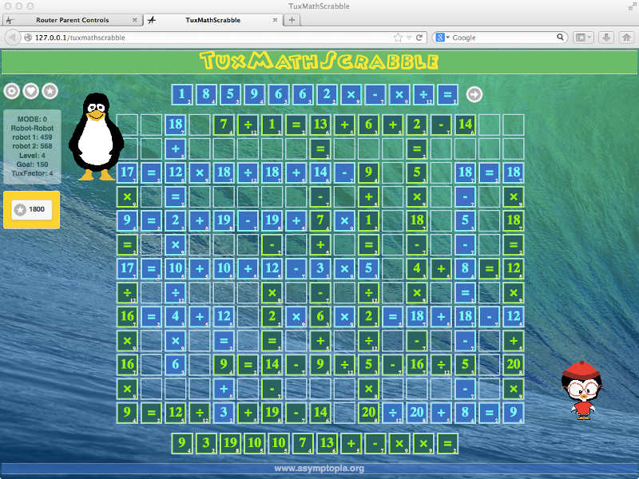
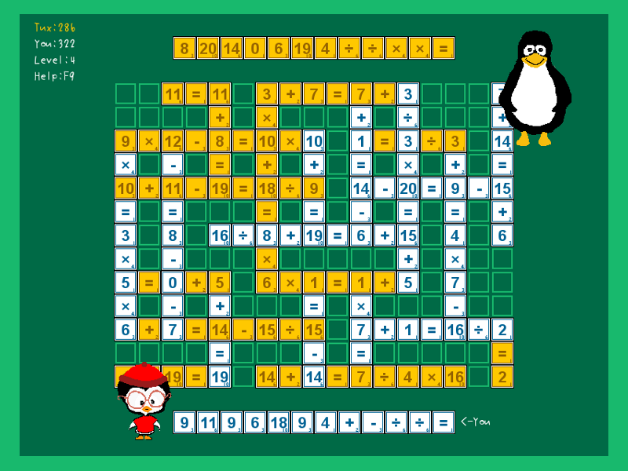

<h2>TuxMathScrabble-HTML5</h2>
<h3>A Math Game</h3>

 

 
<i><b>TuxMathScrabble 2013</b></i>

 

 
<i><b>TuxMathScrabble 2015</b></i>

 

 
<i><b>TuxMathScrabble Python</b></i>

<pre>
# TuxMathScrabble-HTML5

June 14, 2015

This is a stand-alone version of the latest TuxMathScrabble.
Just unzip anywhere you like and load "tuxmathscrabble.html" 
into your browser.  There are no dependencies, spyware, malware,
none of that.  If you like the game then please consider to
make a donation of any amount via www.asymptopia.org.

If you need help you can contact me through asymptopia.org,
as well, and I will be happy to assist.  

This version is being released in somewhat of a hurry, and
there will likely be a cleaner release following, so please
check for future updates and site features, such as mailing
list to inform of updates.

Otherwise, this game is my legacy (!!), I suppose, to a certain
extent, so I hope you enjoy and that it gets used and used some
more!  Enjoy and Thanks for checking it out.

Charles Cosse
ccosse_at_gmail_dot_com

Asymptopia Software
www.asymptopia.org

    Status API Training Shop Blog About Help 

</pre>
